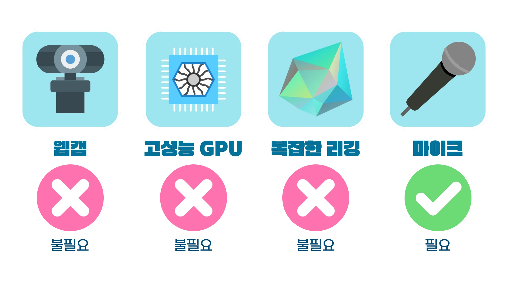

## 신기능 개발로 인해 글을 새로 작성합니다!

캐릭터의 모션에 **입체감**이 부여되었어요. 마우스 커서를 왼쪽이나 오른쪽으로 움직이면 상체뿐 아니라 고개를 돌리는 것처럼 이목구비의 위치도 약간씩 변화합니다.

이 업데이트로 인해 **캐릭터를 얼굴 기준으로 좌우대칭으로 그리는 것**이 권고되어요.

## 들어가며

> 저예산, 저사양 유저를 겨냥한 움직이는 버츄얼 캐릭터

**Browser + GIfTalk + Lightweight Live2D**

## 소개



## 기능

### 리깅 프리셋

페더톡에서는 모션에 따른 각 파츠의 움직임이 미리 계산되어 있습니다.

**#1 이미지 최소화**

8장의 이미지와 6겹의 레이어를 사용하여 캐릭터의 움직임을 구현합니다.

**#2 가동범위**

고개를 위아래로 끄덕이는 등, 위를 보거나 아래를 보는 동작, 고개를 양옆으로 돌리는 등의 동작이 구현되어 있습니다. 또 양 옆으로 커서를 움직이는 경우 해당 모션이 캐릭터의 상체 움직임으로 반영됩니다.

눈을 감았다 뜨거나, 입을 벌렸다 닫는 등의 애니메이션이 구현되어 있습니다.

다만 눈을 굴리거나 다양한 표정을 취할 수 있도록 되어 있지는 않습니다.

### 모션

페더톡은 웹캠 트래킹이나 복잡한 연산과 같이, 높은 CPU/GPU 부하를 가져오는 방식을 사용하지 않습니다.

사용자의 마우스 커서에 반응하거나 혹은 입력과 무관하게 움직이며, 이에 따른 두 종류의 모션을 제공합니다.

**#1 자동 모션**

마우스로 창 위에서 아무런 조작을 하지 않을 떄, 즉 유저가 라이브 창에 포커스를 맞추지 않고 다른 것을 하고 있을 때,

정해진 시간 간격에 따라 랜덤하게 움직이는 모션을 제공합니다.

**#2 마우스를 이용한 모션**

활성화되어 있는 라이브 창 위에 마우스를 올리면 마우스의 움직임을 캐릭터가 따라다닙니다.

조금 더 자연스러운 움직임이 가능한 편입니다.

## 각종 링크

* [Live Page](https://feathertalk.live/)
* [깃허브 저장소](https://github.com/howeverina/feathertalk)
* [소개 페이지](https://slashpage.com/feathertalk)
* [모델 제작 커미션](https://crepe.cm/@however_ina/lc1b0ppq)